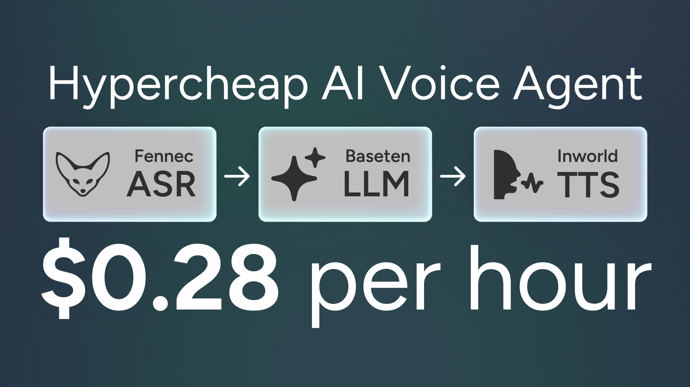

# Hypercheap AI Voice Agent

<p align="center">
  
</p>

### Welcome to the cheapest, lowest-latency, and best performing AI voice agent possible today. 

**This stack achieves:**
- Total costs as low as **\$0.28 per hour** ($0.0046 per minute)
- Latency between 600-800ms from end of speech to first audio frame
- State-of-the-art voice performance thanks to inworld.ai

From a cost perspective, the Hypercheap stack is: 
- **32x** cheaper than OpenAI Realtime
- **20x** cheaper than Elevenlabs Voice Agents
- **10x** cheaper than Vapi

> **Stack:** Fennec (Realtime ASR) → Baseten (LLM via OpenAI-compatible API) → Inworld (streamed TTS)

---
# Demo

https://github.com/user-attachments/assets/f388e02d-0565-4ac0-b1bc-cb9c6651d25d

---
# Setup

## 1) Create accounts & grab keys

### A. Fennec ASR (Realtime speech-to-text)

1. Go to **Fennec** and create a free account (10 hours included): [https://fennec-asr.com](https://fennec-asr.com)
2. Create your first **API key** in the dashboard.

You’ll paste that key into your .env as `FENNEC_API_KEY`.

---

### B. Baseten (LLM — OpenAI-compatible)

1. Sign up for **Baseten** (1 dollar of inference included): [https://app.baseten.co](https://app.baseten.co)
2. Click "Model APIs" and "Add Model API" and create one for "Qwen3 235B A22B"
3. After creating, click "API Endpoint" and generate an API key.
4. This setup calls Baseten via the **OpenAI-compatible** endpoint. The default base URL in this repo is `https://inference.baseten.co/v1` and the default model is `Qwen/Qwen3-235B-A22B-Instruct-2507`.

You’ll paste the API key as `BASETEN_API_KEY` into your .env. Keep the provided base URL and model (or swap to another more performant Baseten model if you like).

---

### C. Inworld (Text‑to‑Speech)

1. Create an **Inworld** account and open the TTS page: [https://inworld.ai/tts](https://inworld.ai/tts)
2. In the **Portal**, generate an **API key (Base64)** and **copy the Base64 value**: [https://portal.inworld.ai](https://portal.inworld.ai)
3. (Optional) Choose a voice and set your defaults (model `inworld-tts-1`, 48 kHz, etc.). You can also clone voices with the inworld platform at no extra cost. 

> The backend expects the **Base64** form for Basic auth. In the portal there’s a *“Copy base64”* button—use that.

Paste the Base64 API key as `INWORLD_API_KEY`. You can also set `INWORLD_VOICE_ID` (e.g. `Olivia`).

---

## 2) Fill your `.env`

Create `voice_backend/.env` (or copy from `voice_backend/.env.example`) and fill the values you just collected:

```env
# Fennec ASR
FENNEC_API_KEY=...
FENNEC_SAMPLE_RATE=16000
FENNEC_CHANNELS=1

# Baseten (OpenAI-compatible)
BASETEN_API_KEY=...
BASETEN_BASE_URL=https://inference.baseten.co/v1
BASETEN_MODEL=Qwen/Qwen3-235B-A22B-Instruct-2507

# Inworld TTS
INWORLD_API_KEY=...  
INWORLD_MODEL_ID=inworld-tts-1
INWORLD_VOICE_ID=Olivia
INWORLD_SAMPLE_RATE=48000
```

For the frontend, create `voice_frontend/.env.local` and point to your backend WebSocket:

```env
VITE_AGENT_WS_URL=ws://localhost:8000/ws/agent
```

---

## 3) Run locally

**Backend**

```bash
cd voice_backend
pip install -r requirements.txt
uvicorn app.main:app --host 0.0.0.0 --port 8000 --reload
```

**Frontend**

```bash
cd voice_frontend
npm install
npm run dev
```

Open [http://localhost:5173](http://localhost:5173) and click the mic button to start chatting.

---

## 4) Docker (optional)

Build the container and run it with your `.env`:

```bash
docker build -t hypercheap-agent:latest -f voice_backend/Dockerfile .
docker run --env-file voice_backend/.env -p 8000:8000 hypercheap-agent:latest
```

If you also want the built UI served by FastAPI, run `npm run build` in `voice_frontend` first — it outputs to `voice_backend/app/static`.

---

## 5) Cost Breakdown (how it’s \~\$0.28/hr)

* **ASR (Fennec, streaming):** as low as **\$0.11/hr** on scale tier (or **\$0.16/hr** starter), with a generous free trial
* **LLM (Baseten Qwen3-235B-A22B):** **\$0.22 / 1M input tokens** and **\$0.80 / 1M output tokens**
* **TTS (Inworld):** **\$5.00 / 1M characters**, which they estimate as **≈\$0.25 per audio‑hour** of generated speech.

> **Example:** In a typical chat, the AI speaks \~40–60% of the time.
>
> • Fennec ASR: \~\$0.11/hr
> • Inworld TTS: \$0.25 × 0.5 = **\$0.125/hr** (assumes 30 min of AI speech per session hour)
> • Baseten LLM tokens: usually **\~\$0.01–\$0.03/hr** at short replies
>
> **Total:** **\~\$0.25–\$0.35 per session hour**

> Actual costs vary with ASR plan, talk ratio, and how verbose the model is. The defaults in this repo (short replies, low max tokens) are tuned to keep costs as low as possible.

---


## 6) Customizations

* Swap voices (Inworld) or LLM models (Baseten) by changing the env vars.
* Tune VAD in `voice_backend/app/agent/fennec_ws.py` for faster/longer turns. It is extremely aggressive by default, which can cut off slow speakers.
* Swap LLMs in Baseten for better intelligence at the price of increased cost and higher latency
* Add in the audio markups into the LLM prompt, and switch the model to the Inworld `inworld-tts-1-max` model for increased realism (at double the cost and ~50% increased latency).
* Adjust history length in `voice_backend/session.py` by altering this: `self._max_history_msgs`. This will increase costs.

MIT © Jordan Gibbs
